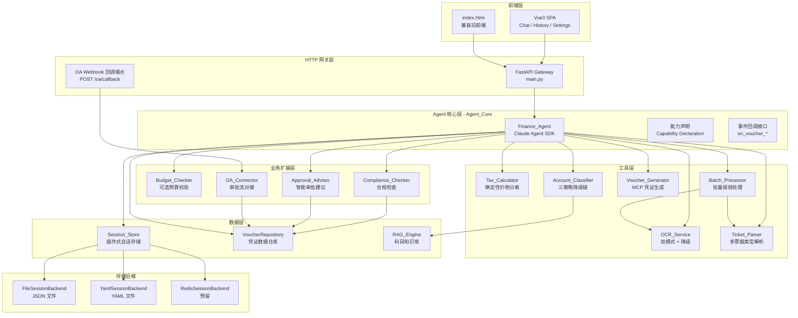
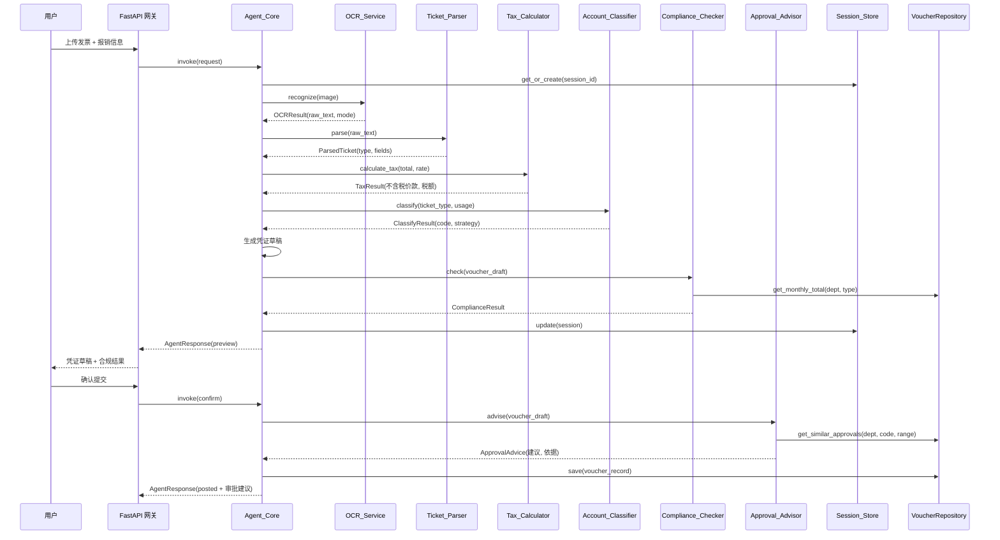

# 设计文档：财务报销 Agent 系统架构升级

> 参考需求文档：#[[file:.kiro/specs/finance-agent-architecture-upgrade/requirements.md]]

## 概述

本设计文档描述"财务报销 Agent 系统"从当前单文件架构向模块化、可扩展、可嵌入架构的全面升级方案。当前系统由 `finance_agent.py`（核心 Agent + 3 个工具）、`main.py`（FastAPI 网关）和 `index.html`（单文件前端）组成，所有逻辑耦合在一起，会话仅存于内存。

升级目标：
1. **短期**：引入确定性计算（Tax_Calculator）、安全约束、插件式会话持久化、OCR 双模式降级、科目匹配多策略链
2. **中期**：批量报销、OA 对接、历史凭证查询（VoucherRepository）、多票据类型解析
3. **长期**：Vue3 前端迁移、Agent 能力扩展（Budget/Compliance/Approval）、子 Agent 可嵌入性

核心设计原则：
- **关注点分离**：Agent_Core 与 HTTP 网关、前端完全解耦
- **插件式架构**：存储后端、OCR 模式、科目策略均可配置切换
- **降级容错**：OCR 云端→本地、科目 rag→llm→keyword、OA Webhook→轮询
- **渐进式升级**：每个模块可独立开发部署，不影响现有功能

## 架构

### 系统架构总览



### 模块目录结构

```
finance-agent/
├── main.py                          # FastAPI 网关（精简，仅路由）
├── index.html                       # 兼容旧前端
├── requirements.txt
├── config.yaml                      # 统一配置文件
├── agent_core/
│   ├── __init__.py
│   ├── core.py                      # Agent_Core：invoke() 入口，能力声明，事件回调
│   ├── finance_agent.py             # Claude Agent SDK 集成，工具注册
│   └── models.py                    # 共享数据模型（Pydantic）
├── tools/
│   ├── __init__.py
│   ├── tax_calculator.py            # 需求1：确定性价税分离
│   ├── ocr_service.py               # 需求2+4：OCR 双模式 + 内网安全
│   ├── account_classifier.py        # 需求5：三策略降级链
│   ├── voucher_generator.py         # 凭证生成器
│   ├── ticket_parser.py             # 需求9：多票据类型解析
│   └── batch_processor.py           # 需求6：批量报销
├── storage/
│   ├── __init__.py
│   ├── session_store.py             # 需求3：Session_Store 插件式架构
│   ├── backends/
│   │   ├── __init__.py
│   │   ├── base.py                  # SessionBackend 抽象接口
│   │   ├── file_backend.py          # JSON 文件后端
│   │   └── yaml_backend.py          # YAML 文件后端
│   └── voucher_repository.py        # 需求8：VoucherRepository
├── extensions/
│   ├── __init__.py
│   ├── budget_checker.py            # 需求11：预算校验（可选）
│   ├── compliance_checker.py        # 需求11：合规检查
│   ├── approval_advisor.py          # 需求11：智能审批建议
│   └── oa_connector.py              # 需求7：OA 对接
├── rag/
│   ├── __init__.py
│   └── engine.py                    # RAG 检索引擎
└── frontend/                        # 需求10：Vue3 前端（独立构建）
    ├── package.json
    ├── src/
    │   ├── App.vue
    │   ├── router/
    │   ├── stores/
    │   ├── components/
    │   └── views/
    └── vite.config.ts
```


## 组件与接口

### 1. Tax_Calculator（需求 1）

确定性价税分离计算工具，替代当前系统提示词中由 AI 推理计算的方式。

```python
# tools/tax_calculator.py

class TaxResult:
    total_amount: Decimal        # 含税总额
    tax_rate: Decimal             # 税率
    amount_without_tax: Decimal   # 不含税价款 = total / (1 + rate)，四舍五入到小数点后两位
    tax_amount: Decimal           # 税额 = total - amount_without_tax
    balanced: bool                # amount_without_tax + tax_amount == total_amount

def calculate_tax(total_amount: Decimal, tax_rate: Decimal | None = None) -> TaxResult:
    """
    确定性价税分离计算。
    - 使用 Decimal 精确计算，避免浮点误差
    - tax_rate 为 None 或 0 时，不含税价款 = 含税总额，税额 = 0
    - total_amount 为负数或非数值时抛出 ValueError
    """
```

设计决策：使用 Python `Decimal` 类型而非 `float`，确保财务计算精度。`amount_without_tax` 使用 `ROUND_HALF_UP` 四舍五入到两位小数，`tax_amount` 通过减法得出（而非独立计算），保证 `amount_without_tax + tax_amount == total_amount` 恒等式恒成立。

### 2. OCR_Service（需求 2 + 4）

统一双模式 OCR 服务，内网安全约束 + 自动降级。

```python
# tools/ocr_service.py

class OCRMode(Enum):
    CLOUD_VL = "cloud_vl"    # PaddleOCR-VL 云端（内网部署）
    LOCAL = "local"           # PaddleOCR 本地模型

class OCRResult:
    raw_text: str
    mode_used: OCRMode        # 实际使用的模式
    elapsed_ms: int           # 识别耗时（毫秒）
    char_count: int

class OCRConfig:
    preferred_mode: OCRMode = OCRMode.CLOUD_VL
    cloud_url: str            # 内网地址，启动时校验格式
    cloud_timeout: int = 30   # 秒
    local_timeout: int = 60   # 秒
    retry_count: int = 1

class OCRService:
    def __init__(self, config: OCRConfig): ...

    async def recognize(self, image_bytes: bytes, filename: str) -> OCRResult:
        """
        1. 尝试 preferred_mode
        2. 云端超时/错误 → 自动降级到本地，记录降级开始时间
        3. 两者均失败 → 抛出 OCRUnavailableError
        4. 降级事件记录到日志（时间戳、错误原因、降级持续时长）
        5. 下次调用自动尝试恢复云端，恢复时计算并补录降级持续时长
        """

    def _validate_intranet_url(self, url: str) -> bool:
        """校验 URL 为内网地址格式（私有 IP 段或内网域名）"""
```

设计决策：
- 云端 URL 启动时校验为内网地址，拒绝外网地址
- 降级后不设"熔断"状态，每次调用都先尝试云端（简单且满足"恢复可用时自动切回"需求）
- 禁止任何 Vision API 调用，OCR_Service 是唯一的图片处理入口

### 3. Session_Store + SessionBackend（需求 3）

插件式会话持久化架构。

```python
# storage/backends/base.py

class SessionData:
    session_id: str
    created_at: datetime
    last_active: datetime
    messages: list[dict]          # 对话记录
    voucher_state: dict | None    # 凭证草稿/状态
    metadata: dict                # 扩展字段

class SessionBackend(ABC):
    """存储后端抽象接口"""
    @abstractmethod
    async def save(self, session: SessionData) -> None: ...
    @abstractmethod
    async def load(self, session_id: str) -> SessionData | None: ...
    @abstractmethod
    async def delete(self, session_id: str) -> None: ...
    @abstractmethod
    async def list(self) -> list[SessionSummary]: ...
    @abstractmethod
    async def get_latest(self) -> SessionData | None: ...
```

```python
# storage/session_store.py

class SessionStore:
    def __init__(self, backend: SessionBackend): ...

    async def get_or_create(self, session_id: str | None = None) -> SessionData:
        """
        - session_id 存在 → load
        - session_id 为 None → get_latest，若无则创建新会话
        - load 失败（损坏/格式错误）→ 记录错误日志，创建新会话，通知上层
        """

    async def update(self, session: SessionData) -> None:
        """状态变更时同步写入后端"""

    async def remove(self, session_id: str) -> None: ...
```

```python
# storage/backends/file_backend.py
class FileSessionBackend(SessionBackend):
    """JSON 文件存储，每个会话一个 .json 文件"""
    def __init__(self, storage_dir: str = "./sessions"): ...

# storage/backends/yaml_backend.py
class YamlSessionBackend(SessionBackend):
    """YAML 文件存储"""
    def __init__(self, storage_dir: str = "./sessions"): ...
```

设计决策：
- 通过配置项 `session_backend_class` 指定后端类名（如 `"storage.backends.file_backend.FileSessionBackend"`），运行时动态加载
- `SessionBackend` 接口设计兼容键值存储（Redis），`save/load` 以 `session_id` 为 key
- `get_latest` 按 `last_active` 排序返回最近会话

### 4. Account_Classifier（需求 5）

三策略降级链科目匹配。

```python
# tools/account_classifier.py

class ClassifyStrategy(Enum):
    RAG = "rag"
    LLM = "llm"
    KEYWORD = "keyword"

class ClassifyResult:
    account_code: str
    account_name: str
    strategy_used: ClassifyStrategy
    confidence: float
    fallback_path: list[ClassifyStrategy]   # 如 ["rag", "llm", "keyword"]

class AccountClassifier:
    def __init__(self, strategy_chain: list[ClassifyStrategy], rag_engine: RAGEngine | None, confidence_threshold: float = 0.7): ...

    async def classify(self, ticket_type: str, usage: str) -> ClassifyResult:
        """
        按 strategy_chain 顺序尝试：
        1. RAG：检索前 3 候选，最高相似度 < threshold → 降级
        2. LLM：通过 MCP 获取科目列表 + LLM 推理，失败 → 降级
        3. Keyword：硬编码规则兜底，始终可用
        """

    async def _classify_rag(self, description: str) -> ClassifyResult | None: ...
    async def _classify_llm(self, description: str) -> ClassifyResult | None: ...
    async def _classify_keyword(self, description: str) -> ClassifyResult: ...
```

### 5. Ticket_Parser（需求 9）

多票据类型差异化解析器。

```python
# tools/ticket_parser.py

class TicketType(Enum):
    VAT_SPECIAL = "vat_special"       # 增值税专用发票
    VAT_NORMAL = "vat_normal"         # 增值税普通发票
    ELECTRONIC = "electronic"         # 电子发票
    TRAIN = "train"                   # 火车票
    FLIGHT = "flight"                 # 机票行程单
    TAXI = "taxi"                     # 出租车票
    TOLL = "toll"                     # 过路费发票
    UNKNOWN = "unknown"               # 未知类型

class ParsedTicket:
    ticket_type: TicketType
    fields: dict                  # 类型特定字段
    raw_text: str                 # OCR 原始文本
    validation_errors: list[str]  # 字段校验错误

class TicketParser:
    def parse(self, ocr_text: str) -> ParsedTicket:
        """
        1. 根据文本特征判断票据类型
        2. 按类型提取对应字段
        3. 执行字段校验规则
        4. 无法识别 → UNKNOWN + 原始文本
        """

    def format(self, ticket: ParsedTicket) -> str:
        """将结构化票据格式化为文本表示"""
```

设计决策：每种票据类型有独立的字段提取规则和校验规则。`parse → format → parse` 往返一致性是关键正确性属性。

### 6. Batch_Processor（需求 6）

批量报销处理，并发控制 + 超时管理。

```python
# tools/batch_processor.py

class InvoiceStatus(Enum):
    QUEUED = "queued"
    PROCESSING = "processing"
    SUCCESS = "success"
    FAILED = "failed"
    TIMEOUT = "timeout"
    REJECTED = "rejected"       # 超过大小限制

class BatchConfig:
    max_concurrency: int = 3
    total_timeout: int = 300     # 秒
    max_image_size_mb: int = 10

class BatchResult:
    total: int
    success_count: int
    failed_count: int
    voucher_count: int
    total_amount: Decimal
    items: list[BatchItemResult]  # 每张发票的状态和结果

class BatchProcessor:
    def __init__(self, ocr: OCRService, parser: TicketParser, config: BatchConfig): ...

    async def process(self, images: list[ImageInput], strategy: str = "separate") -> BatchResult:
        """
        1. 校验每张图片大小（> 10MB → rejected）
        2. 使用 asyncio.Semaphore 控制并发度
        3. asyncio.wait_for 控制总超时
        4. 失败的跳过，继续处理其余
        5. 按票据类型和科目分组
        6. 根据 strategy（merge/separate）生成凭证
        """

    async def _process_single(self, image: ImageInput) -> BatchItemResult: ...
```

### 7. OA_Connector（需求 7）

OA 系统对接，Webhook 优先 + 轮询降级。

```python
# extensions/oa_connector.py

class OAConfig:
    api_url: str
    auth_type: str                # "bearer" | "basic" | "hmac"
    auth_credentials: dict
    field_mapping: dict           # 凭证字段 → OA 字段映射
    webhook_secret: str           # 回调签名密钥
    polling_interval: int = 60    # 轮询间隔（秒）
    use_webhook: bool = True

class OAConnector:
    async def submit_voucher(self, voucher: MCP_Voucher) -> SubmitResult:
        """提交凭证到 OA，成功则回写审批单号"""

    async def handle_webhook(self, payload: dict, signature: str) -> None:
        """处理 OA 回调，校验签名，更新凭证状态"""

    async def poll_status(self, approval_id: str) -> ApprovalStatus:
        """轮询模式：查询审批状态"""
```

### 8. VoucherRepository（需求 8）

独立于 SessionBackend 的凭证数据仓库。

```python
# storage/voucher_repository.py

class VoucherQuery:
    voucher_id: str | None = None
    date_from: date | None = None
    date_to: date | None = None
    department: str | None = None
    submitter: str | None = None
    keyword: str | None = None

class VoucherRepository:
    async def save(self, voucher: VoucherRecord) -> None: ...
    async def query(self, q: VoucherQuery) -> list[VoucherRecord]: ...
    async def get_by_id(self, voucher_id: str) -> VoucherRecord | None: ...
    async def search(self, keyword: str) -> list[VoucherRecord]: ...

    # 为 Compliance_Checker 和 Approval_Advisor 提供的聚合查询
    async def get_monthly_total(self, department: str, expense_type: str, month: date) -> Decimal:
        """按部门+费用类型查询月度累计金额"""

    async def get_similar_approvals(self, department: str, account_code: str, amount_range: tuple[Decimal, Decimal]) -> list[ApprovalRecord]:
        """
        按相似条件查询历史审批记录及通过率。
        amount_range 计算规则：以当前凭证金额为基准，取 ±30% 作为区间，
        即 (amount * 0.7, amount * 1.3)，最小下界为 0。
        调用方（ApprovalAdvisor）负责根据凭证金额计算区间后传入。
        """
```

### 9. Agent_Core（需求 12）

解耦的核心能力层，支持独立模式和嵌入模式。

```python
# agent_core/core.py

class AgentMode(Enum):
    STANDALONE = "standalone"    # 自带 HTTP 网关
    EMBEDDED = "embedded"        # 作为子 Agent

class CapabilityDeclaration:
    agent_name: str = "finance-reimbursement-agent"
    description: str = "企业财务报销智能代理"
    supported_intents: list[str] = ["invoice_reimbursement", "voucher_query", "batch_reimbursement"]
    input_schema: dict
    output_schema: dict

class AgentCore:
    def __init__(self, mode: AgentMode, config: AgentConfig): ...

    async def invoke(self, request: AgentRequest) -> AgentResponse:
        """
        统一入口，接收结构化请求，返回结构化结果。
        嵌入模式下接受外部 session_context 和 user_identity。
        """

    def get_capability(self) -> CapabilityDeclaration: ...

    def register_mcp_tools(self) -> list[MCPTool]:
        """嵌入模式：将工具注册为 MCP 工具供 Orchestrator 发现"""

    # 事件回调
    on_voucher_created: Callable | None = None
    on_voucher_confirmed: Callable | None = None
    on_voucher_submitted: Callable | None = None
```

### 10. Budget_Checker / Compliance_Checker / Approval_Advisor（需求 11）

```python
# extensions/budget_checker.py
class BudgetChecker:
    enabled: bool = False   # 默认禁用

    async def check(self, department: str, amount: Decimal) -> BudgetResult:
        """查询部门预算余额，与凭证金额比较"""

# extensions/compliance_checker.py
class ComplianceChecker:
    def __init__(self, voucher_repo: VoucherRepository, rules: ComplianceRules): ...

    async def check(self, voucher: VoucherDraft) -> ComplianceResult:
        """
        检查规则：
        - 单笔报销金额上限
        - 同一费用类型月度累计上限（通过 VoucherRepository 查询）
        - 票据日期有效期
        """

# extensions/approval_advisor.py
class ApprovalAdvisor:
    AMOUNT_RANGE_RATIO: float = 0.3   # 金额区间浮动比例，±30%

    def __init__(self, voucher_repo: VoucherRepository): ...

    async def advise(self, voucher: VoucherDraft) -> ApprovalAdvice:
        """
        1. 根据凭证金额计算相似区间：(amount * 0.7, amount * 1.3)
        2. 通过 VoucherRepository.get_similar_approvals(department, account_code, amount_range)
           查询历史相似凭证的审批记录
        3. 统计通过率，生成建议（通过/关注/驳回）+ 依据（相似案例数、通过率）
        """
```


## 数据模型

### 核心数据模型（Pydantic）

```python
# agent_core/models.py
from pydantic import BaseModel, Field
from decimal import Decimal
from datetime import datetime, date
from enum import Enum
from typing import Optional

# ── 价税分离 ──

class TaxResult(BaseModel):
    total_amount: Decimal
    tax_rate: Decimal
    amount_without_tax: Decimal
    tax_amount: Decimal
    balanced: bool = Field(description="amount_without_tax + tax_amount == total_amount")

# ── OCR ──

class OCRMode(str, Enum):
    CLOUD_VL = "cloud_vl"
    LOCAL = "local"

class OCRResult(BaseModel):
    raw_text: str
    mode_used: OCRMode
    elapsed_ms: int
    char_count: int

# ── 票据 ──

class TicketType(str, Enum):
    VAT_SPECIAL = "vat_special"
    VAT_NORMAL = "vat_normal"
    ELECTRONIC = "electronic"
    TRAIN = "train"
    FLIGHT = "flight"
    TAXI = "taxi"
    TOLL = "toll"
    UNKNOWN = "unknown"

class ParsedTicket(BaseModel):
    ticket_type: TicketType
    fields: dict
    raw_text: str
    validation_errors: list[str] = []

# ── 科目匹配 ──

class ClassifyStrategy(str, Enum):
    RAG = "rag"
    LLM = "llm"
    KEYWORD = "keyword"

class ClassifyResult(BaseModel):
    account_code: str
    account_name: str
    strategy_used: ClassifyStrategy
    confidence: float
    fallback_path: list[ClassifyStrategy] = []

# ── 凭证 ──

class VoucherEntry(BaseModel):
    account_code: str
    account_name: str
    debit: Decimal = Decimal("0")
    credit: Decimal = Decimal("0")

class VoucherDraft(BaseModel):
    voucher_id: str
    summary: str
    department: str
    submitter: str
    usage: str
    entries: list[VoucherEntry]
    total_debit: Decimal
    total_credit: Decimal
    balanced: bool

class VoucherRecord(BaseModel):
    """持久化凭证记录（VoucherRepository 存储）"""
    voucher_id: str
    created_at: datetime
    department: str
    submitter: str
    summary: str
    usage: str
    entries: list[VoucherEntry]
    total_amount: Decimal
    approval_status: ApprovalStatus = ApprovalStatus.PENDING
    approval_id: Optional[str] = None
    expense_type: str = ""            # 费用类型分类（如 "差旅费"、"交通费"），由 Account_Classifier 匹配结果填充，用于 VoucherRepository 按费用类型聚合查询
    source_tickets: list[ParsedTicket] = []
    session_id: Optional[str] = None

# ── 会话 ──

class SessionSummary(BaseModel):
    session_id: str
    created_at: datetime
    last_active: datetime
    voucher_count: int = 0

class SessionData(BaseModel):
    session_id: str
    created_at: datetime
    last_active: datetime
    messages: list[dict] = []
    voucher_state: Optional[dict] = None
    metadata: dict = {}

# ── 批量处理 ──

class InvoiceStatus(str, Enum):
    QUEUED = "queued"
    PROCESSING = "processing"
    SUCCESS = "success"
    FAILED = "failed"
    TIMEOUT = "timeout"
    REJECTED = "rejected"

class BatchItemResult(BaseModel):
    index: int
    filename: str
    status: InvoiceStatus
    ticket: Optional[ParsedTicket] = None
    error: Optional[str] = None

class BatchResult(BaseModel):
    total: int
    success_count: int
    failed_count: int = Field(description="包含 FAILED、TIMEOUT、REJECTED 三种状态的发票总数")
    voucher_count: int
    total_amount: Decimal = Field(description="所有识别成功的发票含税总额之和（不含失败/拒绝的发票）")
    items: list[BatchItemResult]

# ── OA 对接 ──

class ApprovalStatus(str, Enum):
    PENDING = "pending"
    APPROVED = "approved"
    REJECTED = "rejected"
    RETURNED = "returned"

class SubmitResult(BaseModel):
    success: bool
    approval_id: Optional[str] = None
    error: Optional[str] = None

# ── Agent 核心 ──

class UserIdentity(BaseModel):
    user_id: str
    department: str
    role: str

class AgentRequest(BaseModel):
    intent: str
    session_id: Optional[str] = None
    session_context: Optional[dict] = None
    user_identity: Optional[UserIdentity] = None
    message: Optional[str] = None
    images: list[dict] = []
    parameters: dict = {}

class AgentAction(str, Enum):
    NONE = "none"           # 普通对话，无凭证操作
    PREVIEW = "preview"     # 凭证草稿预览
    POSTED = "posted"       # 凭证已提交
    ERROR = "error"         # 处理失败

class AgentResponse(BaseModel):
    success: bool
    reply: str
    action: AgentAction = AgentAction.NONE
    voucher_data: Optional[VoucherDraft] = None
    mcp_voucher: Optional[dict] = None
    batch_result: Optional[BatchResult] = None
    errors: list[str] = []

# ── 合规与审批 ──

class ComplianceViolation(BaseModel):
    rule_name: str
    description: str
    policy_reference: str

class ComplianceResult(BaseModel):
    passed: bool
    violations: list[ComplianceViolation] = []

class ApprovalRecommendation(str, Enum):
    APPROVE = "approve"
    ATTENTION = "attention"
    REJECT = "reject"

class BudgetResult(BaseModel):
    enabled: bool                          # Budget_Checker 是否启用
    passed: bool                           # 是否通过预算校验（未启用时为 True）
    department: str = ""
    budget_remaining: Optional[Decimal] = None   # 部门剩余预算
    voucher_amount: Optional[Decimal] = None     # 凭证金额
    overspend_amount: Optional[Decimal] = None   # 超支金额（仅超支时有值）
    warning_message: Optional[str] = None        # 超支警告信息

class ApprovalAdvice(BaseModel):
    recommendation: ApprovalRecommendation
    reason: str
    similar_cases_count: int
    approval_rate: float
```

### 配置模型

```yaml
# config.yaml
ocr:
  preferred_mode: cloud_vl
  cloud_url: "http://192.168.1.100:8868/ocr"
  cloud_timeout: 30
  local_timeout: 60
  retry_count: 1

session:
  backend_class: "storage.backends.file_backend.FileSessionBackend"
  storage_dir: "./sessions"

account_classifier:
  strategy_chain: ["rag", "llm", "keyword"]
  confidence_threshold: 0.7

rag:
  enabled: false                                    # RAG 为可选扩展，默认禁用
  knowledge_base_dir: "./rag/knowledge_base"        # 科目知识库文件目录
  embedding_model: "BAAI/bge-small-zh-v1.5"        # 向量化模型（本地或远程）
  embedding_api_url: ""                             # 远程 embedding 服务地址（为空则使用本地模型）
  top_k: 3                                          # 检索返回候选科目数量
  # 注意：strategy_chain 中包含 "rag" 但 rag.enabled=false 时，
  # Account_Classifier 将自动跳过 RAG 策略，按降级链继续执行

batch:
  max_concurrency: 3
  total_timeout: 300
  max_image_size_mb: 10

oa:
  enabled: false
  api_url: ""
  auth_type: "bearer"
  use_webhook: true
  webhook_secret: ""
  polling_interval: 60

extensions:
  enable_budget_check: false
  compliance:
    max_single_amount: 50000
    max_monthly_by_type: 200000
    ticket_validity_days: 180

agent:
  mode: standalone   # standalone | embedded
  model: "claude-sonnet-4-20250514"
  max_turns: 20
```

### 数据流：单张发票报销




## 正确性属性

*正确性属性是指在系统所有有效执行中都应成立的特征或行为——本质上是关于系统应该做什么的形式化陈述。属性是人类可读规范与机器可验证正确性保证之间的桥梁。*

### Property 1: 价税分离恒等式不变量

*For any* 有效的含税总额（正数）和税率（≥0），Tax_Calculator 计算的 `amount_without_tax + tax_amount` 必须严格等于 `total_amount`，且 `amount_without_tax` 等于 `total_amount / (1 + tax_rate)` 四舍五入到小数点后两位。

**Validates: Requirements 1.1, 1.2, 1.3**

### Property 2: 无效输入错误处理

*For any* 负数或非数值类型的含税总额输入，Tax_Calculator 必须抛出包含参数名称和期望类型的错误信息，而非返回计算结果。

**Validates: Requirements 1.5**

### Property 3: 内网地址校验

*For any* URL 字符串，OCR_Service 的地址校验函数对内网地址（私有 IP 段 10.x.x.x、172.16-31.x.x、192.168.x.x 或内网域名）返回 True，对外网地址返回 False。

**Validates: Requirements 2.1, 2.4**

### Property 4: 会话存储往返一致性

*For any* 有效的 SessionData 对象，通过任意 SessionBackend 实现（FileSessionBackend 或 YamlSessionBackend）执行 save 后再 load，应返回与原始对象等价的数据。

**Validates: Requirements 3.4, 3.5, 3.6, 8.4**

### Property 5: get_latest 返回最近活跃会话

*For any* 包含多个会话的存储后端，get_latest 返回的会话的 `last_active` 时间戳必须大于或等于所有其他会话的 `last_active` 时间戳。

**Validates: Requirements 3.7, 8.3**

### Property 6: 会话删除后不可加载

*For any* 已保存的会话，执行 delete 后再 load 同一 session_id，应返回 None。

**Validates: Requirements 3.9**

### Property 7: OCR 降级与恢复

*For any* OCR 请求，当云端模式返回错误或超时时，OCR_Service 应自动使用本地模式完成识别，且返回结果中 `mode_used` 为 `"local"`。降级后的下一次调用应首先尝试云端模式。

**Validates: Requirements 4.4, 4.6**

### Property 8: OCR 结果元数据完整性

*For any* 成功的 OCR 识别结果，`mode_used` 字段必须为 `"cloud_vl"` 或 `"local"` 之一，且 `elapsed_ms` 必须为非负整数。

**Validates: Requirements 4.7**

### Property 9: 科目匹配降级链

*For any* 配置的策略降级链（如 rag→llm→keyword），当当前策略失败或置信度低于阈值时，Account_Classifier 必须按链顺序尝试下一策略；当所有高优先级策略不可用时，必须回退到 keyword 模式并返回有效结果。

**Validates: Requirements 5.5, 5.6, 5.8**

### Property 10: 科目匹配结果元数据完整性

*For any* 科目匹配结果，必须包含 `strategy_used`（使用的策略）、`confidence`（置信度分数）和 `fallback_path`（降级路径），且 `strategy_used` 必须是降级链中的某个策略。

**Validates: Requirements 5.7**

### Property 11: 批量处理摘要一致性

*For any* 批量处理结果，`success_count + failed_count` 必须等于 `total`（其中 failed_count 包含 FAILED、TIMEOUT、REJECTED 三种状态），且所有状态为 SUCCESS 的项目都应有有效的 ParsedTicket，所有非 SUCCESS 状态的项目都应有错误原因。失败的发票不影响其余发票的处理。

**Validates: Requirements 6.6, 6.7**

### Property 12: 合并凭证借贷平衡

*For any* 一组同科目发票使用合并策略生成的凭证，`total_debit` 必须等于 `total_credit`，且 `total_debit` 等于所有发票金额之和。

**Validates: Requirements 6.4**

### Property 13: 批量处理并发度限制

*For any* 批量处理请求，同时进行的 OCR 调用数不得超过配置的 `max_concurrency` 值。

**Validates: Requirements 6.9**

### Property 14: 批量处理图片大小限制

*For any* base64 编码大小超过 10MB 的发票图片，Batch_Processor 必须拒绝该图片并将其状态标记为 REJECTED，附带拒绝原因。

**Validates: Requirements 6.11**

### Property 15: Webhook 签名校验

*For any* OA 回调请求，如果请求签名与配置的 `webhook_secret` 不匹配，OA_Connector 必须拒绝该请求。签名匹配的请求应被正常处理。

**Validates: Requirements 7.6**

### Property 16: OA 提交失败状态标记

*For any* OA 接口调用失败的情况，凭证状态必须被标记为"提交失败"，且错误详情被记录。

**Validates: Requirements 7.4**

### Property 17: Webhook 状态同步

*For any* 有效的 Webhook 回调（签名校验通过），本地凭证的审批状态必须更新为回调中携带的状态值。

**Validates: Requirements 7.5**

### Property 18: 凭证存储往返一致性

*For any* 有效的 VoucherRecord，通过 VoucherRepository 执行 save 后再 get_by_id，应返回与原始对象等价的数据。

**Validates: Requirements 8.1**

### Property 19: 凭证查询过滤正确性

*For any* VoucherQuery 条件和凭证数据集，VoucherRepository 返回的所有凭证必须满足查询条件中指定的所有过滤器（日期范围、部门、报销人等）。关键词搜索返回的凭证的摘要字段必须包含该关键词。

**Validates: Requirements 8.2, 8.6**

### Property 20: 月度累计金额聚合正确性

*For any* 部门、费用类型和月份，VoucherRepository 的 `get_monthly_total` 返回值必须等于该条件下所有凭证金额的总和。

**Validates: Requirements 8.7**

### Property 21: 票据解析往返一致性

*For any* 已支持票据类型的有效 ParsedTicket 对象，执行 `parse(format(ticket))` 应产生与原始 ticket 等价的结构化对象。

**Validates: Requirements 9.9**

### Property 22: 合规检查规则覆盖

*For any* 凭证草稿和合规规则配置，当凭证金额超过单笔上限、或同类型月度累计超过上限、或票据日期超过有效期时，Compliance_Checker 必须返回 `passed=False` 并包含具体违规项和对应制度条款。

**Validates: Requirements 11.5, 11.6, 11.8**

### Property 23: 预算超支警告

*For any* 已启用 Budget_Checker 的场景，当凭证金额超过部门剩余预算时，必须生成包含当前预算余额和超支金额的警告信息。

**Validates: Requirements 11.2, 11.3**

### Property 24: 审批建议完整性

*For any* 凭证和历史审批数据，Approval_Advisor 返回的建议必须包含 recommendation（approve/attention/reject）、reason（判断依据）、similar_cases_count（相似案例数）和 approval_rate（通过率）。

**Validates: Requirements 11.9, 11.11**

### Property 25: 嵌入模式外部上下文传递

*For any* 包含 `session_context` 和 `user_identity` 的 AgentRequest，Agent_Core 在嵌入模式下必须使用外部传入的上下文和身份信息，而非依赖内部会话管理。

**Validates: Requirements 12.4, 12.8**


## 错误处理

### 错误处理策略总览

| 模块 | 错误场景 | 处理策略 |
|------|---------|---------|
| Tax_Calculator | 负数/非数值输入 | 抛出 `ValueError`，包含参数名和期望类型 |
| OCR_Service | 云端超时/错误 | 自动降级到本地模式，记录降级日志 |
| OCR_Service | 云端+本地均不可用 | 抛出 `OCRUnavailableError`，提示联系运维 |
| OCR_Service | 外网地址配置 | 启动时校验失败，拒绝启动 |
| Session_Store | 会话数据损坏/格式错误 | 记录错误日志，创建新空会话，通知用户 |
| Session_Store | 存储后端不可用 | 抛出异常，上层捕获后降级为内存模式，并向用户发出明确提示："当前会话数据仅保存在内存中，服务重启后将丢失，请联系运维恢复存储服务" |
| Account_Classifier | RAG 置信度低 | 按降级链切换到 LLM |
| Account_Classifier | LLM/MCP 调用失败 | 按降级链切换到 keyword |
| Account_Classifier | 所有策略失败 | 回退到 keyword（始终可用） |
| Batch_Processor | 单张发票 OCR 失败 | 跳过该发票，继续处理其余，标注失败原因 |
| Batch_Processor | 总超时 | 终止未完成任务，返回已完成结果 |
| Batch_Processor | 图片超过 10MB | 拒绝该图片，状态标记为 REJECTED |
| OA_Connector | 提交失败 | 凭证状态标记为"提交失败"，支持手动重试 |
| OA_Connector | Webhook 签名无效 | 拒绝请求，记录安全日志 |
| OA_Connector | Webhook 不可用 | 降级为定时轮询模式 |
| Ticket_Parser | 无法识别票据类型 | 标记为 UNKNOWN，返回原始文本，提示手动选择 |
| Budget_Checker | 预算查询失败 | 记录错误，跳过预算检查（不阻塞流程） |
| Compliance_Checker | VoucherRepository 查询失败 | 记录错误，跳过月度累计检查，其他规则继续 |

### 错误传播原则

1. **工具层错误**：返回结构化错误对象（包含 error_code、message、context），不抛出异常
2. **Agent_Core 层**：捕获工具层错误，决定是否降级、重试或向用户报告
3. **HTTP 网关层**：捕获 Agent_Core 异常，返回标准 HTTP 错误响应
4. **日志规范**：所有错误记录包含时间戳、模块名、错误类型、上下文信息

## 测试策略

### 测试框架选择

- **单元测试**：`pytest` + `pytest-asyncio`（异步测试支持）
- **属性测试**：`hypothesis`（Python 属性测试库）
- **Mock**：`unittest.mock` + `pytest-mock`

### 属性测试配置

- 每个属性测试最少运行 100 次迭代
- 每个属性测试必须通过注释引用设计文档中的属性编号
- 标签格式：`Feature: finance-agent-architecture-upgrade, Property {number}: {property_text}`

### 测试分层

#### 属性测试（Property-Based Tests）

每个正确性属性对应一个属性测试，使用 `hypothesis` 库生成随机输入：

| 属性 | 测试描述 | 生成器 |
|------|---------|--------|
| Property 1 | 价税分离恒等式 | `st.decimals(min_value=0.01, max_value=1e8)` 生成金额，`st.sampled_from([0, 0.01, 0.03, 0.06, 0.09, 0.13])` 生成税率 |
| Property 2 | 无效输入错误 | `st.one_of(st.integers(max_value=-1), st.text(), st.none())` 生成无效输入 |
| Property 3 | 内网地址校验 | `st.from_regex` 生成内网/外网 URL |
| Property 4 | 会话往返一致性 | 自定义 `SessionData` 生成策略 |
| Property 5 | get_latest 正确性 | 生成多个不同 `last_active` 的会话 |
| Property 6 | 删除后不可加载 | 复用 Property 4 的会话生成器 |
| Property 7 | OCR 降级恢复 | Mock 云端服务，随机注入超时/错误 |
| Property 8 | OCR 结果元数据 | Mock OCR 返回，验证字段 |
| Property 9 | 科目降级链 | Mock RAG/LLM 返回，随机置信度 |
| Property 10 | 科目结果元数据 | 复用 Property 9 |
| Property 11 | 批量摘要一致性 | 生成随机数量的图片（含随机失败） |
| Property 12 | 合并凭证平衡 | 生成随机发票金额列表 |
| Property 13 | 并发度限制 | 生成大批量请求，监控并发数 |
| Property 14 | 图片大小限制 | 生成随机大小的 base64 数据 |
| Property 15 | Webhook 签名 | 生成随机 payload + 正确/错误签名 |
| Property 16 | OA 失败状态 | Mock OA 接口失败 |
| Property 17 | Webhook 状态同步 | 生成随机审批状态变更 |
| Property 18 | 凭证往返一致性 | 自定义 `VoucherRecord` 生成策略 |
| Property 19 | 查询过滤正确性 | 生成随机凭证集 + 随机查询条件 |
| Property 20 | 月度累计正确性 | 生成随机凭证集，验证聚合 |
| Property 21 | 票据解析往返 | 自定义各类型 `ParsedTicket` 生成策略 |
| Property 22 | 合规检查覆盖 | 生成随机凭证 + 随机规则配置 |
| Property 23 | 预算超支警告 | 生成随机预算余额和凭证金额 |
| Property 24 | 审批建议完整性 | 生成随机历史数据和凭证 |
| Property 25 | 外部上下文传递 | 生成随机 UserIdentity 和 session_context |

#### 单元测试（Unit Tests）

单元测试聚焦于具体示例、边界情况和集成点：

- **Tax_Calculator**：税率为 0、税率为 None、典型税率（3%、6%、9%、13%）的具体计算示例
- **OCR_Service**：内网地址格式示例（IP、域名）、外网地址拒绝示例、双模式均不可用的错误消息
- **Session_Store**：会话数据损坏时的恢复行为、空存储时 get_latest 返回 None
- **Ticket_Parser**：每种票据类型的具体解析示例（增值税专票字段、火车票字段等）、未知类型处理
- **Batch_Processor**：20 张发票容量测试、总超时行为、空批次处理
- **OA_Connector**：Webhook 降级为轮询的配置示例
- **Budget_Checker**：禁用时跳过检查的行为验证
- **Agent_Core**：能力声明包含所有必需字段、嵌入模式 MCP 工具注册

#### 集成测试

- FastAPI 端点与 Agent_Core 的集成
- Session_Store 与 FileSessionBackend/YamlSessionBackend 的集成
- Batch_Processor → OCR_Service → Ticket_Parser 的完整流水线
- OA_Connector Webhook 端点的端到端测试
