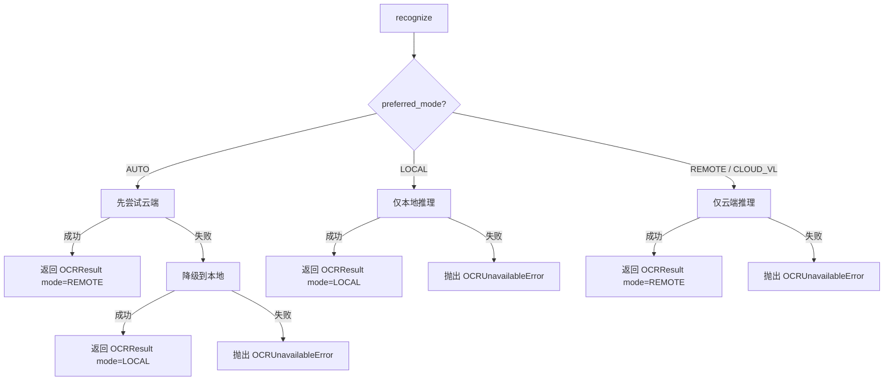
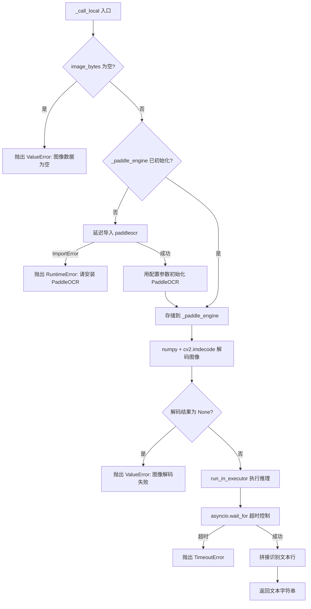

# 设计文档：本地 PaddleOCR 回退

## 概述

本设计实现 OCRService 的本地 PaddleOCR 推理能力，将现有的 `_call_local` 存根替换为基于 PaddleOCR Python 库的完整本地推理实现。核心变更包括：

1. **三模式路由**：将 `OCRMode` 从二值（CLOUD_VL / LOCAL）扩展为三模式（AUTO / LOCAL / REMOTE），`recognize()` 路由逻辑完全重写
2. **懒加载 PaddleOCR 引擎**：首次调用 `_call_local` 时才导入 `paddleocr` 并初始化模型，避免启动开销
3. **线程池异步推理**：PaddleOCR 推理在 `run_in_executor` 中执行，配合 `asyncio.wait_for` 实现超时控制
4. **优雅降级**：PaddleOCR 未安装时仅影响本地模式，云端模式和应用启动不受影响

设计目标是最小化对现有代码的侵入。

### 变更文件清单

| 文件 | 变更内容 |
|------|----------|
| `agent_core/models.py` | `OCRMode` 枚举新增 `AUTO`、`REMOTE` 值，保留 `CLOUD_VL` 作为向后兼容别名 |
| `agent_core/config.py` | 应用层 `OCRConfig` 新增四个本地配置字段，`preferred_mode` 默认值改为 `"auto"` |
| `tools/ocr_service.py` | 服务层 `OCRConfig` 同步新增字段；`OCRService` 重写 `recognize()` 路由、实现 `_call_local`、新增 `_paddle_engine` 属性 |
| `agent_core/core.py` | `AgentCore.__init__` 构造 `OCRServiceConfig` 时传递新增字段 |
| `requirements.txt` | 新增 `numpy`、`opencv-python-headless`，注释声明可选的 `paddleocr`、`paddlepaddle` |
| `config.yaml` | 新增本地 OCR 配置项示例 |

注意：`agent_core/models.py` 中存在已知的代码结构问题（`AgentMode` 和 `CapabilityDeclaration` 在 `AgentRequest` 类内部被重复定义为嵌套类），这不是本次设计引入的问题，但实施时需注意新增 `OCRMode` 枚举值时不要触发该问题——`OCRMode` 定义在模块顶层，与嵌套类无关。

## 架构

### 整体调用流程



### _call_local 内部流程



## 组件与接口

### 1. OCRMode 枚举变更（agent_core/models.py）

```python
class OCRMode(str, Enum):
    AUTO = "auto"
    LOCAL = "local"
    REMOTE = "remote"
    CLOUD_VL = "cloud_vl"  # 向后兼容别名，等价于 REMOTE
```

设计决策：保留 `CLOUD_VL` 而非删除，因为现有代码（测试、日志、已保存的配置文件）可能引用该值。`CLOUD_VL` 在路由逻辑中与 `REMOTE` 完全等价。

### 2. OCRConfig 变更

两处 OCRConfig 均新增四个字段：

| 字段 | 类型 | 默认值 | 说明 |
|------|------|--------|------|
| `local_lang` | `str` | `"ch"` | PaddleOCR 识别语言 |
| `local_use_angle_cls` | `bool` | `True` | 是否启用方向分类器 |
| `local_use_gpu` | `bool` | `False` | 是否使用 GPU |
| `local_model_dir` | `Optional[str]` | `None` | 自定义模型目录 |

`preferred_mode` 默认值从 `"cloud_vl"` 改为 `"auto"`。

### 3. OCRService 变更（tools/ocr_service.py）

#### 新增私有属性

- `_paddle_engine: Optional[PaddleOCR]` — 懒加载的 PaddleOCR 实例，初始为 `None`

#### recognize() 路由重写

```python
async def recognize(self, image_bytes: bytes, filename: str) -> OCRResult:
    start_time = time.monotonic()
    mode = self._config.preferred_mode

    if mode in (OCRMode.REMOTE, OCRMode.CLOUD_VL):
        return await self._run_remote_only(image_bytes, filename, start_time)
    elif mode == OCRMode.LOCAL:
        return await self._run_local_only(image_bytes, filename, start_time)
    else:  # AUTO
        return await self._run_auto(image_bytes, filename, start_time)
```

三条路由路径：
- `_run_remote_only`：仅云端，失败抛 `OCRUnavailableError`，不记录降级事件
- `_run_local_only`：仅本地，失败抛 `OCRUnavailableError`，不记录降级事件
- `_run_auto`：先云端后本地（保留降级事件记录逻辑），双失败抛 `OCRUnavailableError`

**降级事件追踪范围**：`_fallback_events` 和 `_fallback_start_time` 仅在 AUTO 模式下有效。REMOTE 和 LOCAL 单模式不涉及降级概念，因此不记录降级事件。单模式下失败即终止，不存在"从一个模式降级到另一个模式"的语义。

设计决策：`_run_auto` 不复用现有 `_try_cloud_then_local`，而是新写一个方法。原因是 `_try_cloud_then_local` 内嵌了降级恢复追踪逻辑（`_fallback_start_time`），AUTO 模式需要相同的降级追踪行为，但路由入口和语义不同。重构后 `_try_cloud_then_local` 和 `_try_local_then_cloud` 可以移除或保留为内部实现。

#### _call_local 实现

```python
async def _call_local(self, image_bytes: bytes, filename: str) -> str:
    # 1. 输入校验
    if not image_bytes:
        raise ValueError("图像数据为空")

    # 2. 懒加载 PaddleOCR
    if self._paddle_engine is None:
        try:
            from paddleocr import PaddleOCR
        except ImportError:
            raise RuntimeError(
                "PaddleOCR 未安装，请执行: pip install paddleocr paddlepaddle"
            )
        self._paddle_engine = PaddleOCR(
            lang=self._config.local_lang,
            use_angle_cls=self._config.local_use_angle_cls,
            use_gpu=self._config.local_use_gpu,
            det_model_dir=self._config.local_model_dir,
            rec_model_dir=self._config.local_model_dir,
            cls_model_dir=self._config.local_model_dir,
            show_log=False,
        )
```

**设计决策：`local_model_dir` 统一传递给三个模型目录参数**

PaddleOCR 支持分别指定 `det_model_dir`（检测模型）、`rec_model_dir`（识别模型）、`cls_model_dir`（方向分类模型）三个独立路径。当前设计有意简化为单一 `local_model_dir` 字段，同时传递给三个参数，要求用户将三个模型放在同一目录下。这是 V1 的简化方案，满足大多数部署场景（PaddleOCR 默认下载的模型就在同一目录）。若后续有用户需要分别指定三个模型路径，可扩展为 `local_det_model_dir`、`local_rec_model_dir`、`local_cls_model_dir` 三个独立字段。当 `local_model_dir` 为 `None` 时，PaddleOCR 使用其内置默认模型路径。

    # 3. 图像解码
    import numpy as np
    import cv2
    nparr = np.frombuffer(image_bytes, np.uint8)
    img = cv2.imdecode(nparr, cv2.IMREAD_COLOR)
    if img is None:
        raise ValueError("图像解码失败，请检查文件格式")

    # 4. 线程池推理 + 超时
    import asyncio
    loop = asyncio.get_event_loop()
    future = loop.run_in_executor(None, self._paddle_engine.ocr, img, True)
    result = await asyncio.wait_for(future, timeout=self._config.local_timeout)

    # 5. 结果拼接
    if not result or not result[0]:
        return ""
    lines = [line[1][0] for line in result[0] if line[1]]
    return "\n".join(lines)
```

### 4. AgentCore.__init__ 变更（agent_core/core.py）

在构造 `OCRServiceConfig` 时传递新增的四个字段：

```python
self._ocr_service = OCRService(
    OCRServiceConfig(
        preferred_mode=_ocr_cfg.preferred_mode,
        cloud_url=_ocr_cfg.cloud_url,
        cloud_timeout=_ocr_cfg.cloud_timeout,
        local_timeout=_ocr_cfg.local_timeout,
        retry_count=_ocr_cfg.retry_count,
        local_lang=_ocr_cfg.local_lang,
        local_use_angle_cls=_ocr_cfg.local_use_angle_cls,
        local_use_gpu=_ocr_cfg.local_use_gpu,
        local_model_dir=_ocr_cfg.local_model_dir,
    )
)
```

### 5. 依赖声明（requirements.txt）

```
# PaddleOCR 本地推理（可选，仅 LOCAL/AUTO 模式需要）
# paddleocr>=2.7.0
# paddlepaddle>=2.6.0
numpy
opencv-python-headless
```

`paddleocr` 和 `paddlepaddle` 以注释形式声明为可选依赖，`numpy` 和 `opencv-python-headless` 作为正式依赖添加。

## 数据模型

### OCRMode 枚举（变更后）

```python
class OCRMode(str, Enum):
    AUTO = "auto"        # 先云端后本地，自动降级
    LOCAL = "local"      # 仅本地 PaddleOCR
    REMOTE = "remote"    # 仅云端 API
    CLOUD_VL = "cloud_vl"  # REMOTE 的向后兼容别名
```

### OCRConfig — 应用层（agent_core/config.py）

```python
class OCRConfig(BaseModel):
    preferred_mode: str = "auto"
    cloud_url: str = "http://192.168.1.100:8868/ocr"
    cloud_timeout: int = 30
    local_timeout: int = 60
    retry_count: int = 1
    local_lang: str = "ch"
    local_use_angle_cls: bool = True
    local_use_gpu: bool = False
    local_model_dir: Optional[str] = None
```

### OCRConfig — 服务层（tools/ocr_service.py）

```python
@dataclass
class OCRConfig:
    preferred_mode: OCRMode = OCRMode.AUTO
    cloud_url: str = "http://192.168.1.100:8868/ocr"
    cloud_timeout: int = 30
    local_timeout: int = 60
    retry_count: int = 1
    local_lang: str = "ch"
    local_use_angle_cls: bool = True
    local_use_gpu: bool = False
    local_model_dir: Optional[str] = None
```

### OCRResult 的 mode_used 约定

`OCRResult` 模型不变，`mode_used` 字段类型仍为 `OCRMode`。

**统一规则**：云端成功时 `mode_used` 统一设为 `OCRMode.REMOTE`，本地成功时设为 `OCRMode.LOCAL`。不再使用 `CLOUD_VL` 作为 `mode_used` 的返回值。

**向后兼容影响**：现有代码中检查 `mode_used == OCRMode.CLOUD_VL` 的地方需要更新为 `mode_used == OCRMode.REMOTE`。由于 `CLOUD_VL` 和 `REMOTE` 的字符串值不同（`"cloud_vl"` vs `"remote"`），不能互换比较。实施时需同步更新所有引用 `OCRMode.CLOUD_VL` 作为 `mode_used` 比较值的测试和代码。

### config.yaml 新增字段示例

```yaml
ocr:
  preferred_mode: auto  # auto / local / remote（兼容旧值 cloud_vl）
  cloud_url: "http://10.36.6.252:8100/ocr"
  cloud_timeout: 30
  local_timeout: 60
  retry_count: 1
  local_lang: ch
  local_use_angle_cls: true
  local_use_gpu: false
  # local_model_dir: /path/to/models  # 可选，不设置则使用 PaddleOCR 默认模型
```

## 正确性属性

*属性（Property）是指在系统所有合法执行路径中都应成立的特征或行为——本质上是对系统应做什么的形式化陈述。属性是人类可读规格说明与机器可验证正确性保证之间的桥梁。*

以下属性基于需求文档中的验收标准推导而来，每条属性都包含显式的"对于任意"全称量化语句，适合用 property-based testing 验证。

### 属性 1：配置字段保持与默认值一致

*对于任意* OCRConfig 实例（无论是 Pydantic 还是 dataclass 版本），当未显式提供 `local_lang`、`local_use_angle_cls`、`local_use_gpu`、`local_model_dir` 时，这些字段应分别为 `"ch"`、`True`、`False`、`None`；当显式提供任意合法值时，字段应保持提供的值不变。

**验证需求：1.1**

### 属性 2：应用层到服务层配置传递

*对于任意*一组合法的 OCR 配置值（包括 `local_lang`、`local_use_angle_cls`、`local_use_gpu`、`local_model_dir`），通过应用层 OCRConfig 构造并传递到服务层 OCRConfig 后，服务层实例中的每个字段值应与应用层提供的值完全一致。

**验证需求：1.2**

### 属性 3：PaddleOCR 结果文本行拼接

*对于任意*非空的文字行列表（模拟 PaddleOCR 返回的识别结果），`_call_local` 的输出应等于这些文字行用 `"\n"` 拼接的结果。

**验证需求：3.3**

### 属性 4：非法图像字节触发 ValueError

*对于任意*非空的随机字节序列（非合法图像格式），调用 `_call_local` 应抛出 `ValueError`，且错误消息包含"图像解码失败"。

**验证需求：5.2**

### 属性 5：单模式路由隔离

*对于任意* `preferred_mode` 为 `LOCAL`、`REMOTE` 或 `CLOUD_VL` 的 OCRService 实例，以及任意有效图像字节，`recognize()` 应仅调用该模式对应的后端（LOCAL → `_call_local`，REMOTE/CLOUD_VL → `_call_cloud`），绝不调用另一个后端。

**验证需求：7.4, 7.5**

### 属性 6：AUTO 模式云端失败自动降级

*对于任意*有效图像字节，当 `preferred_mode` 为 `AUTO` 且云端调用抛出异常时，`recognize()` 应降级到本地推理并返回 `mode_used == LOCAL` 的 OCRResult。

**验证需求：7.3**

### 属性 7：本地推理超时强制执行

*对于任意* `local_timeout` 值，当本地 PaddleOCR 推理耗时超过该值时，`_call_local` 应抛出 `asyncio.TimeoutError`，不会无限期阻塞调用方。

**验证需求：8.1, 8.2**

## 错误处理

### 错误分类与处理策略

| 错误场景 | 异常类型 | 处理方式 |
|----------|----------|----------|
| 图像数据为空（`b""`） | `ValueError` | `_call_local` 入口校验，立即抛出 |
| 图像解码失败（非法格式） | `ValueError` | `cv2.imdecode` 返回 None 时抛出 |
| PaddleOCR 未安装 | `RuntimeError` | 延迟导入失败时抛出，包含安装指引 |
| 本地推理超时 | `asyncio.TimeoutError` | `asyncio.wait_for` 超时后抛出 |
| LOCAL 模式下本地失败 | `OCRUnavailableError` | 不降级，直接抛出 |
| REMOTE 模式下云端失败 | `OCRUnavailableError` | 不降级，直接抛出 |
| AUTO 模式下双端均失败 | `OCRUnavailableError` | 云端和本地均失败后抛出 |

### 错误传播链

1. `_call_local` 内部的 `ValueError`、`RuntimeError`、`TimeoutError` 向上传播到路由方法
2. 路由方法（`_run_local_only`、`_run_remote_only`、`_run_auto`）捕获异常并决定是否降级或包装为 `OCRUnavailableError`
3. `recognize()` 将最终异常传播给调用方（`AgentCore._process_request`）
4. `AgentCore` 捕获 `OCRUnavailableError` 并返回用户友好的错误响应

### 线程安全注意事项

- `_paddle_engine` 的懒加载不需要线程锁，因为 `_call_local` 在 async 上下文中调用，Python 的 GIL 保证了单线程初始化
- `run_in_executor` 中的推理调用是线程安全的，因为 PaddleOCR 实例在推理期间不会被并发修改（每次调用独立的图像数据）

## 测试策略

### 双轨测试方法

本功能采用单元测试 + 属性测试的双轨策略：

- **单元测试**：验证具体示例、边界情况和错误条件
- **属性测试**：验证跨所有输入的通用属性

### 属性测试配置

- **测试库**：`hypothesis`（已在 requirements.txt 中声明）
- **最小迭代次数**：每个属性测试至少 100 次
- **标签格式**：每个属性测试必须包含注释引用设计属性
  - 格式：`Feature: local-paddleocr-fallback, Property {number}: {property_text}`
- **每条正确性属性由一个属性测试实现**

### 属性测试清单

| 属性 | 测试描述 | 生成器策略 |
|------|----------|-----------|
| 属性 1 | 生成随机 lang/bool/path 值，构造 OCRConfig 并验证字段 | `st.text()`, `st.booleans()`, `st.none() \| st.text()` |
| 属性 2 | 生成随机配置值，通过应用层传递到服务层并比较 | 同上 |
| 属性 3 | 生成随机文字行列表，mock PaddleOCR 返回值，验证拼接结果 | `st.lists(st.text(min_size=1))` |
| 属性 4 | 生成随机非图像字节，调用 `_call_local` 验证 ValueError | `st.binary(min_size=1)` 过滤掉合法图像头 |
| 属性 5 | 生成随机模式（LOCAL/REMOTE/CLOUD_VL），mock 两个后端，验证仅调用对应后端 | `st.sampled_from([OCRMode.LOCAL, OCRMode.REMOTE, OCRMode.CLOUD_VL])` |
| 属性 6 | 生成随机图像字节，mock 云端失败 + 本地成功，验证返回 LOCAL 结果 | `st.binary(min_size=1)` |
| 属性 7 | 生成随机超时值（0.01-0.5s），mock 慢推理，验证 TimeoutError | `st.floats(min_value=0.01, max_value=0.5)` |

### 单元测试清单

| 测试场景 | 对应需求 |
|----------|----------|
| PaddleOCR 未安装时 `_call_local` 抛出 RuntimeError | 4.1 |
| PaddleOCR 未安装时云端模式正常工作 | 4.2 |
| 空图像字节抛出 ValueError("图像数据为空") | 5.1 |
| 懒加载：构造后 `_paddle_engine` 为 None | 2.1 |
| 懒加载：首次调用后 `_paddle_engine` 非 None | 2.2 |
| 懒加载：多次调用复用同一实例 | 2.3 |
| PaddleOCR 返回 None 时返回空字符串 | 3.4 |
| PaddleOCR 返回空列表时返回空字符串 | 3.4 |
| OCRMode 枚举包含 AUTO、LOCAL、REMOTE、CLOUD_VL | 7.1 |
| preferred_mode 默认值为 "auto" | 7.2 |
| LOCAL 模式 + PaddleOCR 未安装 → OCRUnavailableError | 7.6 |
| REMOTE 模式 + 云端不可用 → OCRUnavailableError | 7.7 |
| config.yaml 接受 auto/local/remote/cloud_vl | 7.8 |
| requirements.txt 包含可选依赖声明 | 6.1, 6.2, 6.3 |
